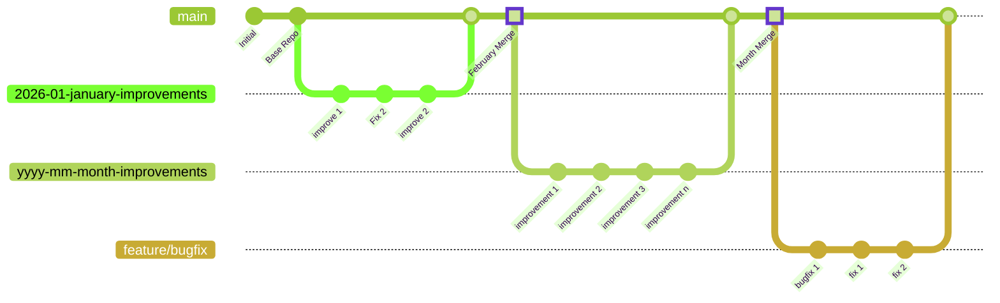

# Centralized Orchestrator repository

## User cases

1. Automatically create a PR at the end of the month for the active repos
2. Generate high level reporting for the GitHub Orgs

### Design Monthly PR



## githhub CLI Cheat Sheet: Running Workflows & Actions Locally

### Prerequisites

```bash
- Install GitHub CLI
- https://cli.github.com/

- Verify installation
gh --version
gh auth status
```

- login If needed

  ```bash
  gh auth login
  ```

### List & View Workflows

#### List all workflows in the repository

- List all workflows

    ```bash
    gh workflow list
    ```

- List specific workflow by name

    ```bash
    gh workflow list --workflow="orchestrator-reporter"
    ```

- action

    ```bash

    ```

#### View workflow file content

- View workflow file

    ```bash
    gh workflow view orchestrator-reporter.yml
    ```

- View with detailed information

    ```bash
    gh workflow view orchestrator-reporter.yml --json=content
    ```

### List & Monitor github Runs

#### List workflow runs

- List all runs for a specific workflow

    ```bash
    gh run list --workflow="orchestrator-reporter.yml"
    ```

- List runs with limit

    ```bash
    gh run list --workflow="orchestrator-reporter.yml" --limit=20
    ```

- List runs with JSON output for parsing

    ```bash
    gh run list --workflow="orchestrator-reporter.yml" --json=status,conclusion,createdAt
    ```

##### List runs with specific status

- completed

    ```bash
    gh run list --workflow="orchestrator-reporter.yml" --status=completed
    ```

- failed runs

    ```bash
    gh run list --workflow="orchestrator-reporter.yml" --status=failed
    ```

- runs in progress

    ```bash
    gh run list --workflow="orchestrator-reporter.yml" --status=in_progress
    ```

#### View run details

```bash
- View specific run details (use run ID from list)
gh run view <RUN_ID>

- View with detailed log output
gh run view <RUN_ID> --log

- View full verbose output
gh run view <RUN_ID> --log-failed
```

### Trigger Workflow Dispatch

#### Manually trigger a workflow with inputs

```bash
- Trigger orchestrator-reporter with repo filter
gh workflow run orchestrator-reporter.yml \
  -f repo_filter="composite-app"

- Trigger orchestrator-prep-monthly-cycle
gh workflow run orchestrator-prep-monthly-cycle.yml

- Trigger add-collaborators workflow
gh workflow run add-collaborators.yml \
  -f collaborator_type="user" \
  -f collaborator_name="username" \
  -f target_repos="all" \
  -f permission="push"
```

### Advanced Filtering & Queries

#### Filter runs by various criteria

```bash
- List runs from specific branch
gh run list --branch=main --workflow="orchestrator-reporter.yml"

- List runs by actor (who triggered it)
gh run list --actor="USERNAME" --workflow="orchestrator-reporter.yml"

- List runs with head SHA
gh run list --workflow="orchestrator-reporter.yml" \
  --json=status,conclusion,headSha,createdAt

- Complex JSON query
gh run list --workflow="orchestrator-reporter.yml" --limit=50 \
  --json=databaseId,status,conclusion,createdAt,updatedAt,name,headBranch \
  --jq '.[] | select(.conclusion=="failure")'
```

### Debugging & Troubleshooting

#### Download logs from a run

```bash
- Download all logs from a run
gh run download <RUN_ID> --dir=./logs

- View logs for specific step
gh run view <RUN_ID> --log | grep "step_name"
```

#### Check workflow syntax

```bash
- Validate workflow file (requires workflow-run command)
- Alternative: check GitHub UI or use local act tool
```

#### View job logs

```bash
- List jobs in a run
gh run view <RUN_ID> --json=jobs

- View specific job output
gh run view <RUN_ID> --json=jobs --jq '.jobs[] | select(.name=="job_name")'
```

### Local Execution with `act`

#### Install and setup `act`

```bash
- Install act (GitHub Actions local runner)
- https://github.com/nektos/act

- macOS with Homebrew
brew install act

- Windows with Scoop
scoop install act

- Or download from releases
```

#### Run workflows locally `act`

- List available workflows locally

    ```bash
    act --list
    ```

```bash

- Run default workflow
act

- Run specific workflow
act -j "report-all-repos"

- Run with workflow dispatch inputs
act workflow_dispatch \
  -i repo_filter="composite-app"

- Run with secrets from environment
act -s GH_TOKEN="ghp_xxxx" \
    -s ORG_LEVEL_TOKEN="ghp_xxxx"

- Run with verbose output
act -v

- Run and keep job container after execution
act --reuse
```

### Useful JSON Output Patterns

#### Get all runs as CSV-like output

```bash
gh run list --workflow="orchestrator-reporter.yml" \
  --json=databaseId,status,conclusion,createdAt,name \
  --jq -r '.[] | [.databaseId, .status, .conclusion, .createdAt, .name] | @csv'
```

#### Find failed runs

```bash
gh run list --workflow="orchestrator-reporter.yml" \
  --json=databaseId,conclusion,createdAt \
  --jq '.[] | select(.conclusion=="failure")'
```

#### Get recent runs with timestamps

```bash
gh run list --workflow="orchestrator-reporter.yml" --limit=10 \
  --json=databaseId,createdAt,updatedAt,status \
  --jq '.[] | "\(.databaseId) | Created: \(.createdAt) | Updated: \(.updatedAt) | \(.status)"'
```

### Common Workflows Reference

#### orchestrator-reporter.yml

```bash
- List all runs
gh run list --workflow="orchestrator-reporter.yml"

- Trigger manually
gh workflow run orchestrator-reporter.yml -f repo_filter="utilities"

- View latest run
gh run view $(gh run list --workflow="orchestrator-reporter.yml" --json=databaseId --limit=1 --jq='.[0].databaseId')
```

#### orchestrator-prep-monthly-cycle.yml

```bash
- List all runs
gh run list --workflow="orchestrator-prep-monthly-cycle.yml"

- Trigger manually (scheduled, can be run anytime)
gh workflow run orchestrator-prep-monthly-cycle.yml

- Check last run logs
gh run view $(gh run list --workflow="orchestrator-prep-monthly-cycle.yml" --json=databaseId --limit=1 --jq='.[0].databaseId') --log
```

#### add-collaborators.yml

```bash
- List all runs
gh run list --workflow="add-collaborators.yml"

- Trigger with specific parameters
gh workflow run add-collaborators.yml \
  -f collaborator_type="user" \
  -f collaborator_name="john-doe" \
  -f target_repos="all" \
  -f permission="push"

- Check run status
gh run view <RUN_ID> --log | grep -i "summary"
```

### Tips & Tricks

1. **Save the latest run ID in a variable**

   ```bash
   LATEST_RUN=$(gh run list --workflow="orchestrator-reporter.yml" --limit=1 --json=databaseId --jq='.[0].databaseId')
   gh run view $LATEST_RUN --log
   ```

2. **Monitor a running workflow**

   ```bash
   watch -n 5 'gh run view <RUN_ID>'
   ```

3. **Get notified when workflow completes**

   ```bash
   while [ $(gh run view <RUN_ID> --json=status --jq='.status') != "completed" ]; do sleep 30; done && echo "Workflow completed!"
   ```

4. **Export workflow runs to file**

   ```bash
   gh run list --workflow="orchestrator-reporter.yml" --limit=100 \
     --json=databaseId,status,conclusion,createdAt,name > workflow_runs.json
   ```

5. **Filter by conclusion type**

   ```bash
   gh run list --workflow="orchestrator-reporter.yml" --limit=50 \
     --json=databaseId,conclusion \
     --jq '.[] | select(.conclusion=="failure") | .databaseId'
   ```
