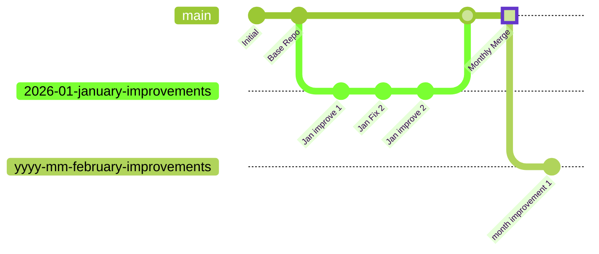

# centralized Orchestrator repository

## User cases
1. Automatically create a PR at the end of the month for the active repos
2. Generate high level reporting for the GitHub Orgs

### Design Monthly PR

